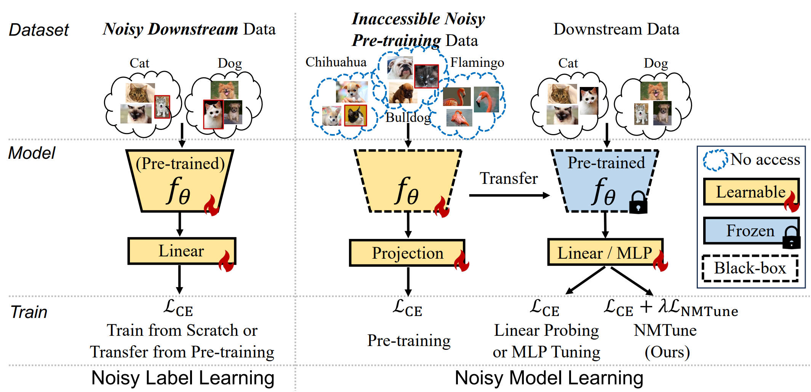

   
  <strong>
    Original research on enhancement of LLMs conducted by Microsoft Research and other collaborated institutes.
  </strong> 
  (Contact: <a href="https://jd92.wang/">Jindong Wang</a>, also see our projects on <a href="https://llm-eval.github.io/">LLM evaluation</a>)

 

- [Understanding and Mitigating the Label Noise in Pre-training on Downstream Tasks](#understanding-and-mitigating-the-label-noise-in-pre-training-on-downstream-tasks)
- [EmotionPrompt: Leveraging Psychology for Enhancement via Emotional Stimulus](#emotionprompt-leveraging-psychology-for-enhancement-via-emotional-stimulus)
- [Exploring Vision-Language Models for Imbalanced Learning](#exploring-vision-language-models-for-imbalanced-learning)
- [FedCLIP: Fast Generalization and Personalization for CLIP in Federated Learning](#fedclip-fast-generalization-and-personalization-for-clip-in-federated-learning)

- - -

## Understanding and Mitigating the Label Noise in Pre-training on Downstream Tasks
 

  Hao Chen1,
  Jindong Wang#2, 
  Ankit Shah2, 
  Ran Tao1,  
  Hongxin Wei3, 
  Xing Xie2, 
  Masashi Sugiyama4,
  Bhiksha Raj1

  

1 Carnegie Mellon University,
2 Microsoft Research,
3 SusTech,
4 University of Tokyo 
(#: Co-corresponding author)

[<a href="https://arxiv.org/pdf/2309.17002.pdf">Paper</a>]

Abstract

Pre-training on large-scale datasets and then fine-tuning on downstream tasks have become a standard practice in deep learning. However, pre-training data often contain label noise that may adversely affect the generalization of the model. This paper aims to understand the nature of noise in pre-training datasets and to mitigate its impact on downstream tasks. More specifically, through extensive experiments of supervised pre-training models on synthetic noisy ImageNet-1K and YFCC15M datasets, we demonstrate that while slight noise in pre-training can benefit in-domain (ID) transfer performance, where the training and testing data share the same distribution, it always deteriorates out-of-domain (OOD) performance, where training and testing data distribution are different. We empirically verify that the reason behind is noise in pre-training shapes the feature space differently. We then propose a lightweight black-box tuning method (NMTune) to affine the feature space to mitigate the malignant effect of noise and improve generalization on both ID and OOD tasks, considering one may not be able to fully fine-tune or even access the pre-trained models. We conduct practical experiments on popular vision and language models that are pre-trained on noisy data for evaluation of our approach. Our analysis and results show the importance of this interesting and novel research direction, which we term Noisy Model Learning.

- - -

## EmotionPrompt: Leveraging Psychology for Enhancement via Emotional Stimulus
 

  Cheng Li1,
  Jindong Wang#2, 
  Kaijie Zhu2, 
  Yixuan Zhang3,  
  Wenxin Hou2, 
  Jianxun Lian2, 
  Xing Xie2

  

1 Institute of Software, CAS,
2 Microsoft,
3 College of William and Mary 
(#: Co-corresponding author)

[<a href="https://arxiv.org/pdf/2307.11760.pdf">Paper</a>]
[Media coverage <a href="https://techxplore.com/news/2023-08-exploring-effects-emotional-stimuli-large.html">1</a>,<a href="https://webappia.com/investigating-the-impact-of-emotional-stimuli-on-language-models-emotionalai/?feed_id=13302&_unique_id=64cfac8201058">2</a>,<a href="https://flowgpt.com/blog/emoGPT">3</a>,<a href="https://mp.weixin.qq.com/s/z-lg-yDibKoT_gO97HSK5Q">4</a>]

Abstract

Large language models (LLMs) have achieved significant performance in many fields such as reasoning, language understanding, and math problem-solving, and are regarded as a crucial step to artificial general intelligence (AGI). However, the sensitivity of LLMs to prompts remains a major bottleneck for their daily adoption. In this paper, we take inspiration from psychology and propose EmotionPrompt to explore emotional intelligence to enhance the performance of LLMs. EmotionPrompt operates on a remarkably straightforward principle: the incorporation of emotional stimulus into prompts. Experimental results demonstrate that our EmotionPrompt, using the same single prompt templates, significantly outperforms original zero-shot prompt and Zero-shot-CoT on 8 tasks with diverse models: ChatGPT, Vicuna-13b, Bloom, and T5. Further, EmotionPrompt was observed to improve both truthfulness and informativeness. We believe that EmotionPrompt heralds a novel avenue for exploring interdisciplinary knowledge for humans-LLMs interaction.

- - -

## Exploring Vision-Language Models for Imbalanced Learning

*This work accepted minor revision at **IJCV 2023**.*

  Yidong Wang1,
  Zhuohao Yu1,
  Jindong Wang#2,  
  Qiang Heng3,  
  Hao Chen4, 
  Wei Ye#1,  
  Rui Xie1, 
  Xing Xie2, 
  Shikun Zhang#1 

  

1 Peking University
2 Microsoft Research,
3 North Carolina State University,
4 Carnegie Mellon University 
(#: Corresponding authors)

[<a href="https://arxiv.org/pdf/2304.01457.pdf">Paper</a>]
[<a href="https://github.com/Imbalance-VLM/Imbalance-VLM">Github</a>]

Abstract

Vision-Language models (VLMs) that use contrastive language-image pre-training have shown promising zero-shot classification performance. However, their performance on imbalanced dataset is relatively poor, where the distribution of classes in the training dataset is skewed, leading to poor performance in predicting minority classes. For instance, CLIP achieved only 5% accuracy on the iNaturalist18 dataset. We propose to add a lightweight decoder to VLMs to avoid OOM (out of memory) problem caused by large number of classes and capture nuanced features for tail classes. Then, we explore improvements of VLMs using prompt tuning, fine-tuning, and incorporating imbalanced algorithms such as Focal Loss, Balanced SoftMax and Distribution Alignment. Experiments demonstrate that the performance of VLMs can be further boosted when used with decoder and imbalanced methods. Specifically, our improved VLMs significantly outperforms zero-shot classification by an average accuracy of 6.58%, 69.82%, and 6.17%, on ImageNet-LT, iNaturalist18, and Places-LT, respectively. We further analyze the influence of pre-training data size, backbones, and training cost. Our study highlights the significance of imbalanced learning algorithms in face of VLMs pre-trained by huge data. We release our code at https://github.com/Imbalance-VLM/Imbalance-VLM.

- - -

## FedCLIP: Fast Generalization and Personalization for CLIP in Federated Learning

*This work is published at **IEEE Data Engineering Bulletin** 2023.*

  Wang Lu1,  
  Xixu Hu2,  
  Jindong Wang#3,  
  Xing Xie3 
  (#: Corresponding authors)

  

1 Chinese Academy of Sciences
2 City University of Hong Kong,
3 Microsoft Research 

[<a href="https://arxiv.org/pdf/2302.13485v2.pdf">Paper</a>]
[<a href="https://github.com/microsoft/PersonalizedFL">Github</a>]

Abstract

Federated learning (FL) has emerged as a new paradigm for privacy-preserving computation in recent years. Unfortunately, FL faces two critical challenges that hinder its actual performance: data distribution heterogeneity and high resource costs brought by large foundation models. Specifically, the non-IID data in different clients make existing FL algorithms hard to converge while the high resource costs, including computational and communication costs that increase the deployment difficulty in real-world scenarios. In this paper, we propose an effective yet simple method, named FedCLIP, to achieve fast generalization and personalization for CLIP in federated learning. Concretely, we design an attention-based adapter for the large model, CLIP, and the rest operations merely depend on adapters. Lightweight adapters can make the most use of pretrained model information and ensure models be adaptive for clients in specific tasks. Simultaneously, small-scale operations can mitigate the computational burden and communication burden caused by large models. Extensive experiments are conducted on three datasets with distribution shifts. Qualitative and quantitative results demonstrate that FedCLIP significantly outperforms other baselines (9% overall improvements on PACS) and effectively reduces computational and communication costs (283x faster than FedAVG). Our code will be available at: https://github.com/microsoft/PersonalizedFL.

